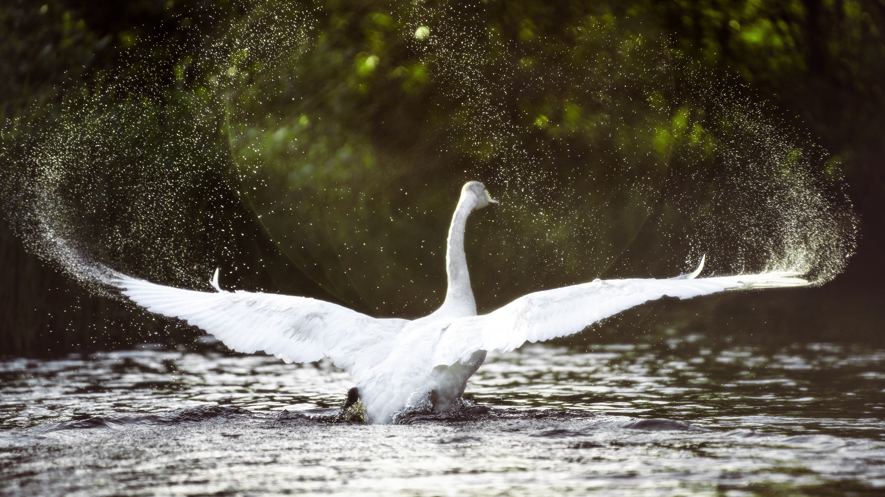

A long overdue review of the 5 books I read last month.

## These Violent Delights
> by Chloe Gong

This was an exceptionally fun read! Chloe Gong takes *Romeo and Juliet* and turns it into a fast-paced gangster fantasy set in 1920s Shanghai. The two main characters have a great deal of chemistry and I really loved learning a bit about Shanghai's history and the tensions between native Shanghainese and foreigners in the 1920s. I'm looking forward to reading the next book when it comes out (although knowing how Romeo and Juliet end up in the original play, I think I might have gotten a bit too invested in these characters)!

## Atomic Habits
> by James Clear

As someone who struggles with perfectionism and procrastination I'm glad I picked up this book, and I'd definitely recommend it to anyone who's interested. James Clear helps highlight the benefits of good habit-making, which involves setting up systems of bite-sized goals and incentivizing yourself to follow through with these habits. Unfortunately a lot of self-help books I've seen seem to be [written by and for a specific audience](https://qz.com/1106341/most-women-reading-self-help-books-are-getting-advice-from-men/), and this one is no exception. I struggled to relate to a lot of the anecdotes in this book, since they were overwhelmingly about men and sports.

## The Hobbit
> by J. R. R. Tolkien

This was an adventurous yet cozy story from the perspective of a somewhat unwilling, but endearing, protagonist. I love any story with a magical forest (no matter how corrupted the forest may be)!

## Winter Hours
> by Mary Oliver

In *Winter Hours*, Mary Oliver quietly ponders over the intricacies and wonders of her daily life and the natural world—a family of spiders, a little hummingbird, her dog's footprints, her partner's whistling, the process of building a house. Reading this book helped me calm down and appreciate the world around me, although it did make me feel inexplicably lonely.

## Swan
> by Mary Oliver

A beautiful selection of nature-related poems. Here are two of my favorites:

### The Poet Dreams of the Mountain

Sometimes I grow weary of the days, with all their fits and starts. \
I want to climb some old gray mountain, slowly, taking \
the rest of my lifetime to do it, resting often, sleeping \
under the pines or, above them, on the unclothed rocks. \
I want to see how many stars are still in the sky \
that we have smothered for years now, a century at least. \
I want to look back at everything, forgiving it all, \
and peaceful, knowing the last thing there is to know. \
All that urgency! Not what the earth is about! \
How silent the trees, their poetry being of themselves only. \
I want to take slow steps, and think appropriate thoughts. \
In ten thousand years, maybe, a piece of the mountain will fall.

### The Swan

Did you too see it, drifting, all night, on the black river? \
Did you see it in the morning, rising into the silvery air – \
An armful of white blossoms, \
A perfect commotion of silk and linen as it leaned \
into the bondage of its wings; a snowbank, a bank of lilies, \
Biting the air with its black beak? \
Did you hear it, fluting and whistling \
A shrill dark music – like the rain pelting the trees – like a waterfall \
Knifing down the black ledges? \
And did you see it, finally, just under the clouds – \
A white cross Streaming across the sky, its feet \
Like black leaves, its wings Like the stretching light of the river? \
And did you feel it, in your heart, how it pertained to everything? \
And have you too finally figured out what beauty is for? \
And have you changed your life? 

---

### Currently Reading
- *The Fellowship of the Ring* by J. R. R. Tolkien
- *How We Became Human* by Joy Harjo
- *Tokyo Ueno Station* by Miri Yū

### On Hiatus
(a.k.a. I'll finish these when I'm in the mood!)
- *The Joy Luck Club* by Amy Tan
- *The Disordered Cosmos* by Chanda Prescod-Weinstein
- *Pride and Prejudice* by Jane Austen
- *Engaging the Enemy* by Elizabeth Moon
- *Ninth House* by Leigh Bardugo

### Want to Read
(a.k.a. books I'll probably start reading once I finish with the current batch)
- *Forest Primeval* by Chris Maser
- *Spark Joy* by Marie Kondō
- *The Two Towers* by J. R. R. Tolkien

---

## Sources

(Including this for my media class 😛)

### Images

Szmigiel, Lukasz. “Low-Light Photo of Forest.” Unsplash, 12 Mar. 2015, https://unsplash.com/photos/2ShvY8Lf6l0.

Bast, Olga. “White Swan on Water during Daytime.” Unsplash, 29 July 2020, https://unsplash.com/photos/xsA0SbYduh0.

### Quotes and Information

Zhou, Youyou. “Who Reads Self-Help Books? Goodreads Data Show Women Are Reading Books Written by Men.” Quartz, 14 Jan. 2019, https://qz.com/1106341/most-women-reading-self-help-books-are-getting-advice-from-men.

Oliver, Mary. *Swan: Poems and Prose Poems.* Beacon Press, 2012.
