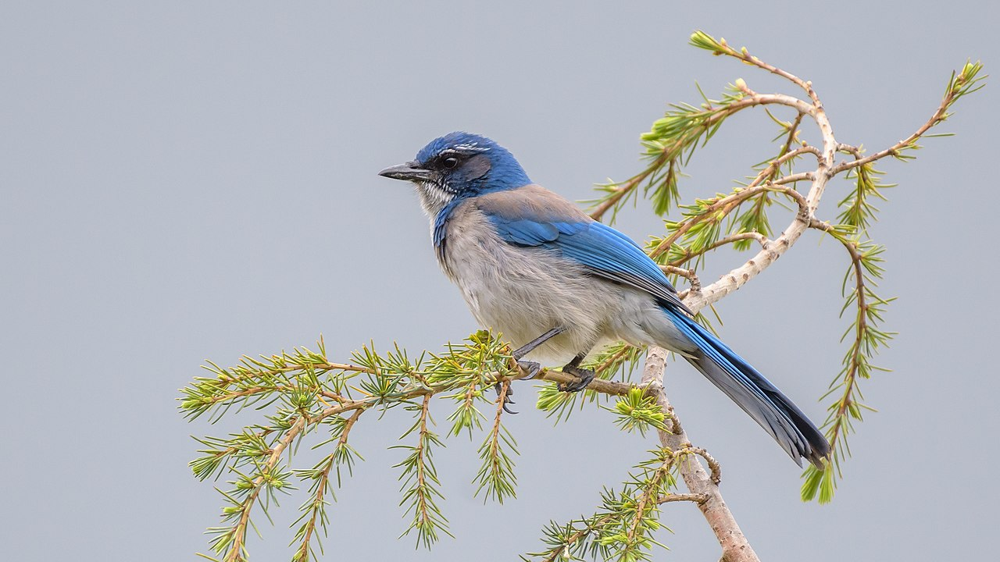
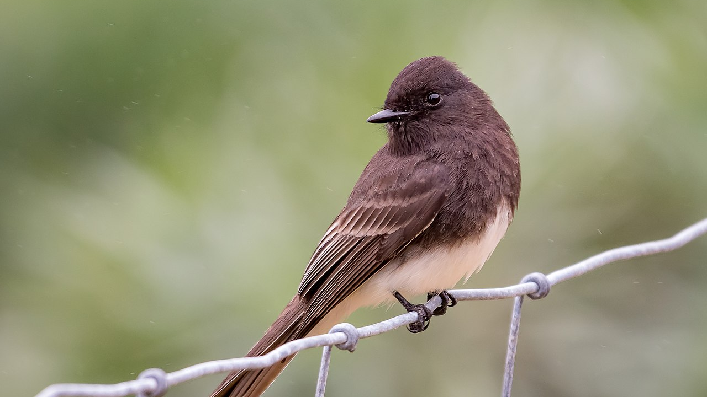
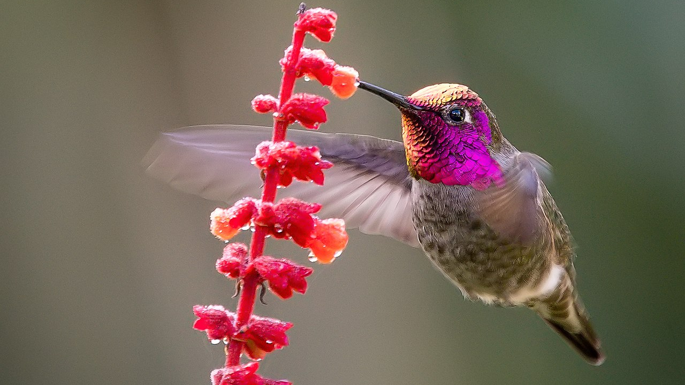
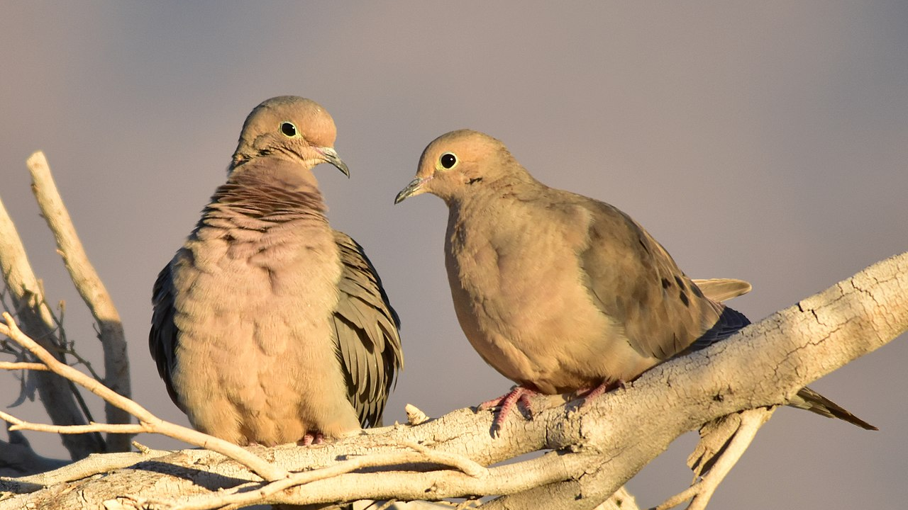
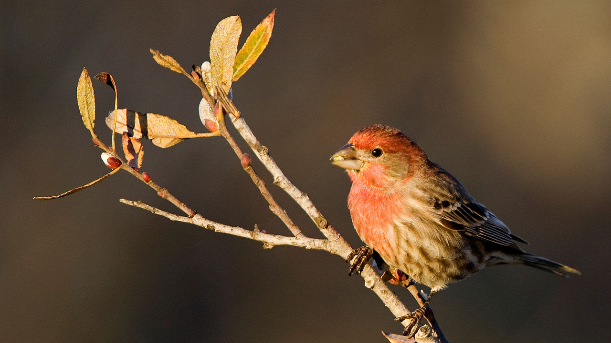

Spring is underway and I've been enjoying listening to birdsong and spotting birds out my window, and I've also become more and more interested in being able to identify these little critters. Below is a small list of birds I see and hear a lot throughout the year, along with some interesting facts about them. 

(The featured image above is of a pair of red-winged blackbirds, which are also common in Northern California but aren't mentioned in this list. Another one of my favorite birds I've heard this spring is the [Golden-crowned Sparrow](https://www.allaboutbirds.org/guide/Golden-crowned_Sparrow/overview), whose three-note song is just so adorable and sweet!)

---

### California Scrub Jay

> *Aphelocoma californica*

These feisty birds have a distinctive pattern of blue, grey, and white feathers. California Scrub Jays live in wooded areas and dine on seeds, nuts, insects, and small animals (as well as my cats' food). Their calls are loud and shrill, which makes it no surprise that they're in the Corvidae family, which includes crows and ravens.

---

### Black Phoebe

> *Sayornis nigricans*

Black Phoebes are flycatchers, which means they get their food by catching insects out of midair. As their name suggests, these little birds are primarily black, but with a white-grey underbelly. They can usually be found perching on fence posts and low rooftops close to the ground, giving out short, high chirps.

---

### Anna's Hummingbird

> *Calypte anna*

Anna's hummingbirds are the tiniest and flashiest birds I've seen in the wild. Males have iridescent red head feathers, and enjoy perching on the highest branches of trees and letting out long series of shrill trills. Most impressive is their way of courting females — first, a male soars up and hovers as high as 130 feet while trilling. Then, he dives down at speeds of over 50 miles per hour, and lets out a single, earsplitting chirp with his tail feathers at the bottom of his dive. He performs this display multiple times in a row in front of his target.



---

### Mourning Dove

> *Zenaida macroura*

These birds live up to their name with their slow, plaintive coos. Mourning Doves mate for life, and they nest in trees and forage for seeds on the ground. One fact about them that I found interesting is that when they take off, they make a quick whistling sound — however, similar to the Anna's hummingbird's tail chirp, this whistling actually comes from their wing feathers.

---

### House Finch

> *Haemorhous mexicanus*

House finches are native to western North America, where they live in a wide variety of habitats ranging from urban to rural areas, and from dry deserts to forests. These red-headed birds can now be found increasingly throughout the US as people introduced them to urban areas in the eastern US in the mid 20th century. Their song is a long, continuous warble of varied notes.

---

## References and Attributions

For my media class, we were assigned to create our own website and research and write content for the website. Luckily I already had the website part down, so all I needed was to write about a topic I find fun and interesting! We also needed to cite our sources for the assignment, which I've done here.

### Information

“California Scrub-Jay Overview, All About Birds, Cornell Lab of Ornithology.” *All About Birds*, 2019, [www.allaboutbirds.org/guide/California_Scrub-Jay/overview](https://www.allaboutbirds.org/guide/California_Scrub-Jay/overview).

“Black Phoebe Overview, All About Birds, Cornell Lab of Ornithology.” *All About Birds*, 2019, [www.allaboutbirds.org/guide/Black_Phoebe/overview](http://www.allaboutbirds.org/guide/Black_Phoebe/overview).

“Anna's Hummingbird Overview, All About Birds, Cornell Lab of Ornithology.” *All About Birds*, 2019, www.allaboutbirds.org/guide/Annas_Hummingbird/overview.

“Mourning Dove Overview, All About Birds, Cornell Lab of Ornithology.” *All About Birds*, 2019, www.allaboutbirds.org/guide/Mourning_Dove/overview.

“House Finch Overview, All About Birds, Cornell Lab of Ornithology.” *All About Birds*, 2019, www.allaboutbirds.org/guide/House_Finch/overview.

### Images

**Red-winged Blackbird** (featured)

Brooks, Allan; Dawson, William Leon; Dickey, Donald R.; Finley, William L.; Pierce, Wright M., CC BY 2.0 [https://creativecommons.org/licenses/by/2.0](https://creativecommons.org/licenses/by/2.0), via Wikimedia Commons

**California Scrub Jay**, **Black Phoebe**, and **Anna's Hummingbird**

Becky Matsubara from El Sobrante, California, CC BY 2.0 [https://creativecommons.org/licenses/by/2.0](https://creativecommons.org/licenses/by/2.0), via Wikimedia Commons

**Mourning Dove**

USFWS Mountain-Prairie, Public domain, via Wikimedia Commons

**House Finch**

Kevin Cole from Pacific Coast, USA, CC BY 2.0 https://creativecommons.org/licenses/by/2.0, via Wikimedia Commons

### Video

*Anna's Hummingbirds Chirp with Their Tails*, New Scientist, 31 Jan. 2008, [www.youtube.com/watch?v=K_2JFK-tnn](www.youtube.com/watch?v=K_2JFK-tnn). 
