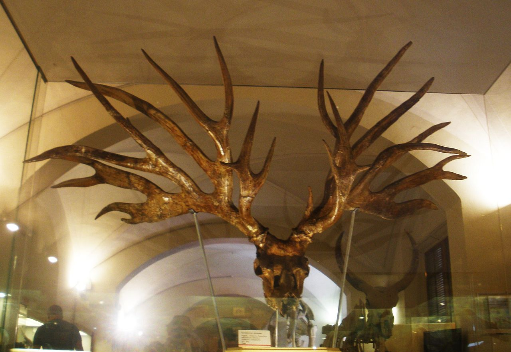
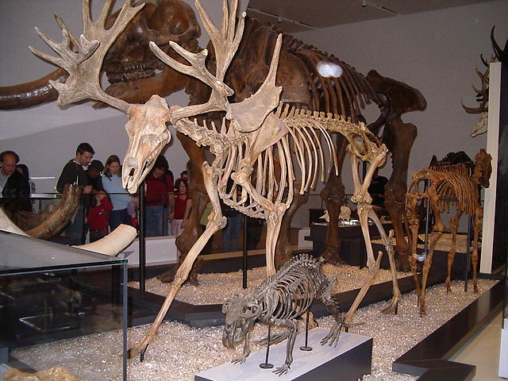
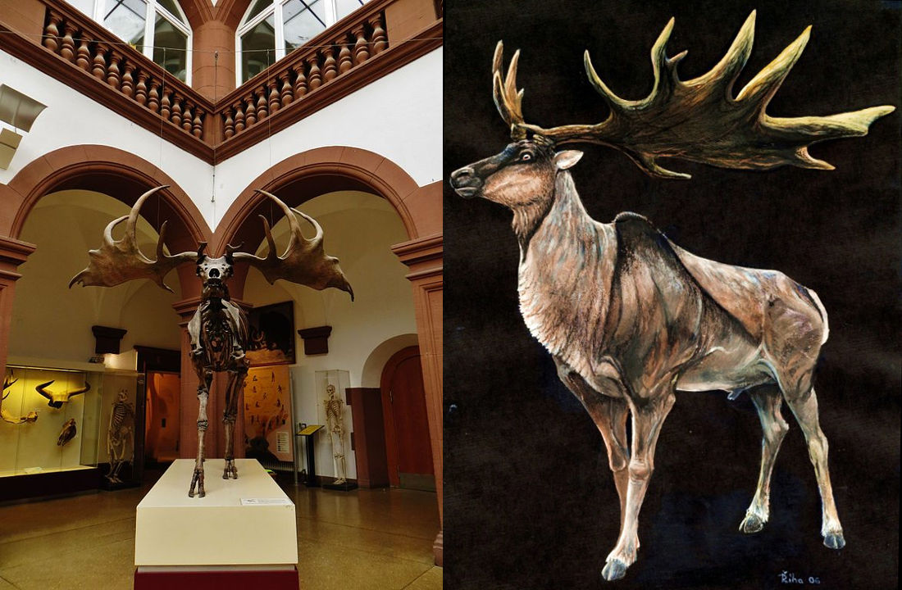

*(Featured image: An outdated 1910 illustration of the Irish Elk)*

The Pleistocene Epoch, also known as the Great Ice Age, was a geologic time period that began 2.6 million years ago and ended 11,700 years ago. It was marked by extensive glaciation and climate change, as well as the emergence of humans. It was the last epoch before our own, the modern-day Holocene.

The Pleistocene saw many awe-inspiring megafauna, such as the [mammoth](https://www.britannica.com/animal/mammoth-extinct-mammal), the [woolly rhinoceros](https://www.britannica.com/animal/woolly-rhinoceros), and the [giant wombat](https://www.britannica.com/animal/Diprotodon). It also saw many species of giant deer, including what is now considered to be the largest deer that ever existed. Below are a few beautiful and impressive species of Pleistocene deer. 

---

### Bush-antlered Deer

> *Eucladoceros dicranios*

The **bush-antlered deer**, *Eucladoceros*, was one of the earlier forms of deer, having been around during the Pliocene, the epoch preceding the Pleistocene beginning about 4 million years ago. The most iconic species of the genus, *Eucladoceros dicranios*, had glorious branching antlers that spanned over 5½ feet wide! (They remind me a bit of the [deer god from Princess Mononoke](https://ghibli.fandom.com/wiki/Forest_Spirit).)

*Eucladoceros* enjoyed warmer climates and inhabited the [middle latitudes of Eurasia](http://stsmith.faculty.anth.ucsb.edu/classes/anth3/courseware/Pleistocene/6_Bestiary.html#Eucladoceros), all the way from the Iberian peninsula to the northern coasts bordering the Sea of Japan. This deer went extinct sometime in the early-to-mid Pleistocene, likely due to cooling climates and loss of vegetation.

---

### Stag-moose

> *Cervalces scotti*

Native to North America, the **stag-moose** had a magestic and complex set of palmate (or "webbed") antlers and was slightly larger than the modern-day moose — *Alces alces*, the largest currently living deer in the world. *Cervalces scotti* was found primarily in the Midwest and some parts of the eastern US, and lived in wetland habitats similar to those of the modern-day moose. The stag-moose went extinct sometime during the transition between the Pleistocene and the Holocene epochs, along with many other species of megafauna during the [Quaternary extinction](https://en.wikipedia.org/wiki/Quaternary_extinction).

---

### Irish Elk 

> *Megaloceros giganteus*

My favorite (and perhaps the most well-known) Pleistocene deer is the **Irish Elk**, also known as the **Giant Deer**. Although this deer lived throughout Europe and Asia, notable well-preserved fossils were found in peat bogs in Ireland, which gave the Irish Elk its name. Like the stag-moose, *Megaloceros giganteus* faced extinction after the beginning of the Holocene some 11,000 years ago, although some Irish Elk fossils have been found which may have dated back only 7,000–⁠8,000 years.

Although some sources say that [the Irish Elk was the largest deer to have ever existed](https://ucmp.berkeley.edu/mammal/artio/irishelk.html), other sources say that [this title may have actually belonged to the *much* larger *Cervalces latifrons*](https://books.google.com/books?id=bcWZX-IMEVkC&pg=PA122&source=gbs_toc_r&cad=4#v=onepage&q=Cervalces%20latifrons&f=false), the broad-fronted moose (a relative of the stag-moose). While I'm not entirely sure, this disparity might have arisen because the Irish Elk was discovered and catalogued in Europe much earlier than the broad-fronted moose. Nevertheless, the Irish Elk's magestic set of palmated antlers were no doubt the largest of any species of deer, spanning over 12 feet wide!

## References

### Information

Johnson, W. Hilton. "Pleistocene Epoch". Encyclopedia Britannica, 30 Jul. 2018, https://www.britannica.com/science/Pleistocene-Epoch.

Freedman, Jan. “The Beast of the Woods.” TwilightBeasts, 12 Oct. 2018, https://twilightbeasts.org/2018/10/12/the-beast-of-the-woods.

Michaels, George H., and Brian M. Fagan. “A Pleistocene Bestiary.” Univeristy of California Santa Barbara, 2006, http://stsmith.faculty.anth.ucsb.edu/classes/anth3/courseware/Pleistocene/6_Bestiary.html#Eucladoceros.

“Stag-Moose.” Explore the Ice Age Midwest, Illinois State Museum, 2015, http://iceage.museum.state.il.us/mammals/stag-moose-0.

“The Case of the Irish Elk.” UC Museum of Paleontology, 1996, https://ucmp.berkeley.edu/mammal/artio/irishelk.html.

Geist, Valerius. Deer of the world: their evolution, behaviour, and ecology. United States, Stackpole Books, 1998.

### Images

**Irish Elk (featured)**

Doflein, Franz; Hesse, Richard, Public domain, via Wikimedia Commons

**Stag-moose**

Dantheman9758 at English Wikipedia, CC BY 3.0 [https://creativecommons.org/licenses/by/3.0](https://creativecommons.org/licenses/by/3.0), via Wikimedia Commons

**Bush-antlered Deer**

Ghedoghedo, CC BY-SA 3.0 [https://creativecommons.org/licenses/by-sa/3.0](https://creativecommons.org/licenses/by-sa/3.0), via Wikimedia Commons

**Irish Elk**

Ghedoghedo, CC BY-SA 4.0 [https://creativecommons.org/licenses/by-sa/4.0](https://creativecommons.org/licenses/by-sa/4.0), via Wikimedia Commons

Pavel.Riha.CB, CC BY-SA 3.0 [http://creativecommons.org/licenses/by-sa/3.0/](http://creativecommons.org/licenses/by-sa/3.0/), via Wikimedia Commons
